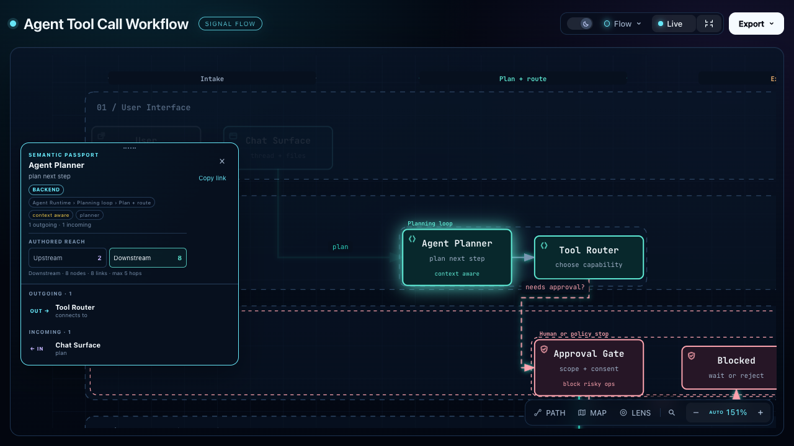
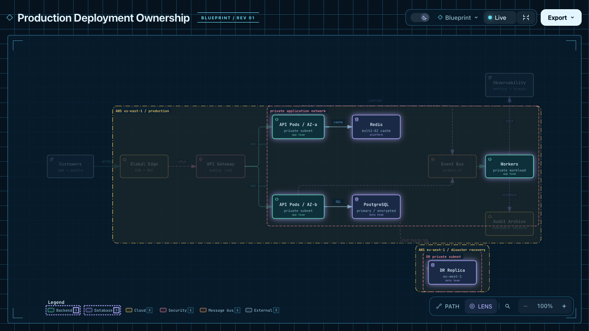
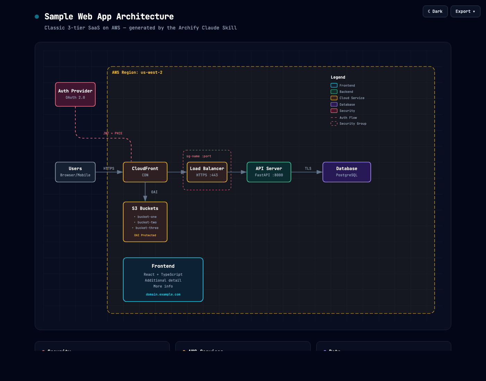
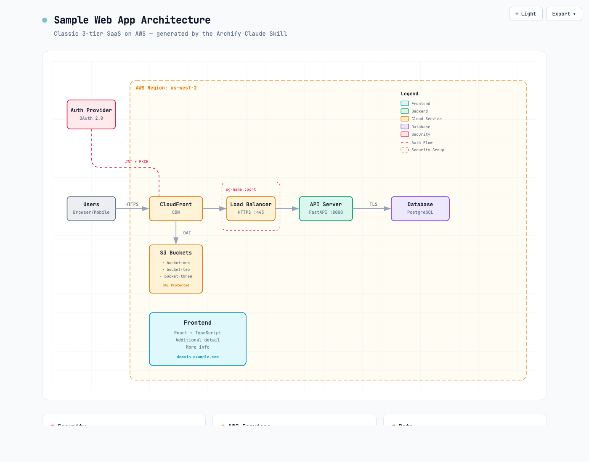
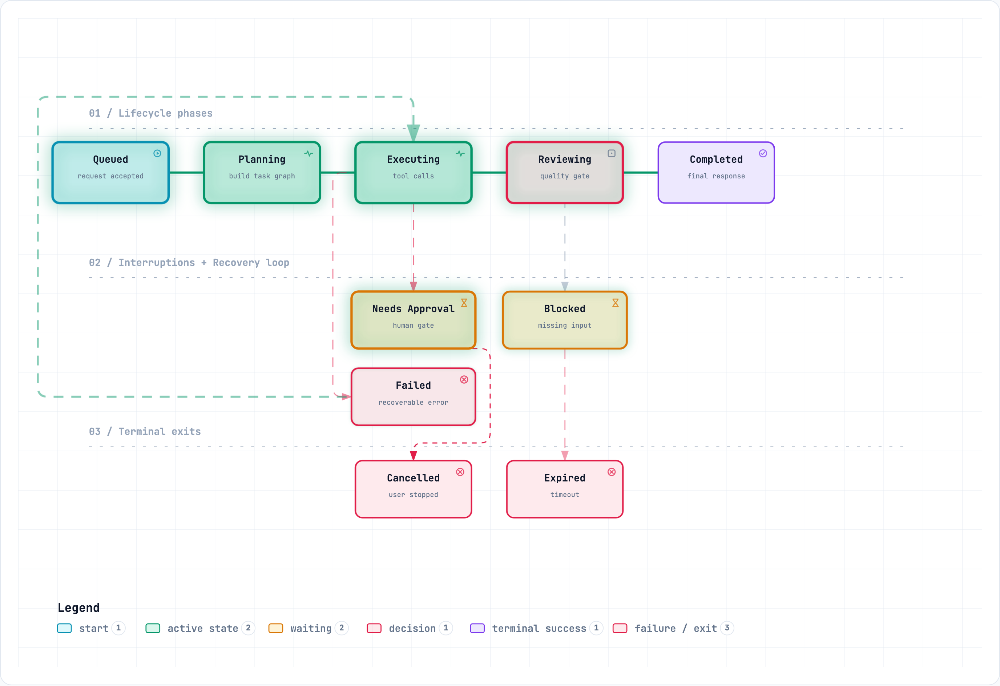

# Archify

> 把任何你想理解、规划或分享的内容，变成可交互的可视化。


从一个想法、一个问题或一份计划开始。把它描述给你的 AI 智能体，Archify 就会把它变成可交互的 HTML，供你探索、定制与分享——从旅行行程、学习地图到复杂系统，都能变成你自己的作品。

看看社区正在创作什么，也想象一下你接下来能做出什么。

[在线演示](https://tt-a1i.github.io/archify/gallery.html) · [快速上手](#start) · [场景指南](https://tt-a1i.github.io/archify/guide.html) · [社区](#community) · [简体中文](./README_ZH.md) · [日本語](./README_JA.md)

  

## 看看 Archify 的实际效果

**一句话，画出你的仓库。** 观看 35 秒演示：浏览图表、跟随源码链接、追踪路径。[打开可交互示例 ↗](https://tt-a1i.github.io/archify/gallery.html)

<a id="start"></a>

### 安装，然后描述你的想法

支持 Cursor、Claude Code、Codex CLI 和 OpenCode。更多集成方式见下方的安装选项。

```bash
npx skills add tt-a1i/archify -g
```

把下面这句话发给你的智能体：

```text
用 Archify 画一个 Web 请求流程：浏览器调用 API，API 查询 Redis，缓存未命中时查询 PostgreSQL 并回填缓存。
```

接着可以继续补充：加上鉴权、高亮缓存未命中的路径、切换到浅色主题。

**不需要任何仓库**：可以从一段描述开始，也可以让智能体读取仓库，生成有源码依据的架构图。

[选择你的智能体](https://tt-a1i.github.io/archify/start.html) · [安装详情与更新检查](#quick-start)

## ❤️ 赞助伙伴

**Archify × Kimi Work。** 在 Kimi Work 插件商店中搜索 **交互式架构图** 即可找到 Archify，用一句话描述你的系统，就能生成可交互图表。[在 Kimi Work 中试用 →](https://www.kimi.ai/?aff=archify)

同时感谢 **Supercode**、**OpenLux** 和 **EverMind（Raven）** 对本项目的支持。

想赞助 Archify？欢迎[邮件联系我们](mailto:2801884530@qq.com)。

## 展示真正重要的部分

| 讲清智能体工作流 | 追踪一次缓存未命中 | 探索服务之间的关系 |
|---|---|---|
| [](https://tt-a1i.github.io/archify/gallery.html) | [](https://tt-a1i.github.io/archify/gallery.html) | [](https://tt-a1i.github.io/archify/gallery.html) |
| 追踪某个步骤的全部下游影响。 | 高亮从 Web 应用到数据库的路径。 | 聚焦后端与数据库之间的连接。 |

[Proof Lab](https://tt-a1i.github.io/archify/gallery.html) 收录了全部 11 个已校验场景、对应的 JSON 源文件以及校验回执。

### 读懂一个真实的仓库

源码 → 图表：带有源码依据的系统地图。Archify 追踪了 [mco-org/mco](https://github.com/mco-org/mco) 并生成了下图，可[打开查看 ↗](https://tt-a1i.github.io/archify/cases/mco-runtime.architecture.html)。

### 易于扩展，随你改造

**图表生成之后还能继续建设。** Archify 是开源的，输出是独立的 HTML 文件。你可以让智能体改造它、接上有用的链接，或加入适配自己工作流的交互。社区作品已经覆盖团队协作、旅行规划、法条引用核查、合同审阅和事故复盘。

有用户从手绘的多智能体架构开始，把它变成可交互图表，再通过对话加上了 Kimi 执行池；也有人让智能体读取项目，再把生成的架构图带进飞书或钉钉讨论。

还有用户把一份上海 CityWalk 攻略变成四天行程：切换日期、查看地点卡片、直接跳转高德、小红书或大众点评，并加入到达打卡和站点笔记。

[▶ 体验可交互的上海 CityWalk](https://tt-a1i.github.io/archify/cases/community/shanghai-citywalk.html)

### 下载、打开、探索

输出是一个自包含的 HTML 文件。下载后用浏览器打开，就能使用其中的节点详情和路径探索功能，查看时无需安装 Archify。把 HTML 发给别人，交互也会一起带过去；外部网站和地图链接需要联网。

[▶ 打开上海 CityWalk](https://tt-a1i.github.io/archify/cases/community/shanghai-citywalk.html) · [下载 HTML ↓](https://github.com/tt-a1i/archify/raw/refs/heads/main/docs/cases/community/shanghai-citywalk.html)

## 社区与认可

- **登上 GitHub Trending 全语言周榜第一。** 作者于 2026 年 9 月 1 日发布了[排名截图](https://x.com/t20000622yy/status/2094656813576880285)。
- **获量子位报道与专访。**[项目报道](https://www.qbitai.com/2026/09/482469.html) · [开发者的故事](https://www.qbitai.com/2026/09/488519.html)。
- **在开发者社区中被分享。**[midudev 的推荐帖](https://x.com/midudev/status/2094425974406320207)。

## 预览

<details>
<summary>主题、导出与分享卡片</summary>

同一张图，两种主题，一键切换：

| 深色 | 浅色 |
|---|---|
|  |  |

导出菜单可以把 PNG 复制到剪贴板，也能下载静态或动态格式：


追踪一条路径后，选择 **导出 → 路径分享卡片**，即可把这条路径下载为 1200×630 的 PNG，并保留完整图表作为上下文。

追踪作者标注的上游或下游范围后，选择 **导出 → 范围分享卡片**，可以如实呈现该范围，而不会声称运行时影响。

在本地打开 [`examples/web-app.html`](examples/web-app.html) 即可体验完整查看器。

</details>

## 快速开始

**当前稳定版本：** `v3.0.1`。详见[更新日志](CHANGELOG.md)。

### 1. 安装

```bash
npx skills add tt-a1i/archify -g
```

<details>
<summary>更多安装方式与更新检查说明</summary>

针对 Cursor 的非交互式安装：

```bash
npx -y skills add tt-a1i/archify --skill archify --agent cursor --global --copy --yes
```

不安装直接试用：

```bash
npx skills use tt-a1i/archify@archify --agent codex
```

DSH 社区可选集成：`dsh plugin --profile web add @tt-a1i/archify-dsh@1.0.0`

[智能体切换器](https://tt-a1i.github.io/archify/start.html)支持 `cursor`、`codex`、`claude-code` 和 `opencode`。

Archify 只会在需要时请求固定的稳定版清单，用来显示可选的更新提醒，绝不下载或安装更新。成功检查后约 24 小时内不再检查；使用活跃时，失败会在 6 小时、24 小时后重试。服务器只能看到常规 HTTP 元数据（IP 与时间），不会收到版本号、智能体信息、项目数据、提示词、账号或设备 ID、ETag。是否以及何时更新由你决定，设置 `ARCHIFY_UPDATE_CHECK_DISABLED=1` 可完全关闭联网与提醒状态写入。

</details>

### 保持更新

- **获取发布通知：** 在本仓库顶部选择 **Watch → Custom → Releases**，仅加星不会订阅发布通知。
- **查看变更内容：**[发布说明](https://github.com/tt-a1i/archify/releases)。
- **使用阅读器订阅：**[发布源](https://github.com/tt-a1i/archify/releases.atom)。

安装了更新检查的版本，在生成图表时也会检查是否有新的稳定版并显示提醒。旧版本需要手动更新才能获得该能力。是否升级由你决定，Archify 永不自动安装更新。

### 2. 从一段描述开始，无需仓库

```text
用 Archify 画：浏览器 -> API -> Redis 缓存 -> PostgreSQL 兜底。
```

如果要带源码依据，打开一个仓库并提问：

```text
分析这个仓库，然后用 archify 生成一份高层运行时架构图。
展示 8 到 12 个核心组件、一条主路径、外部依赖和信任边界。
补充细节请放在卡片里，不要增加更多连线。
```

### 3. 在对话中继续打磨

可以用聚焦的请求继续，例如「加上 Redis」「把鉴权移到左边」「高亮回滚路径」。Archify 会保留带类型的源文件，便于定向迭代。

## 选择合适的图表

<details>
<summary>五种图表类型、架构对比与示例</summary>

| 类型 | 适用场景 | 提示词中要写清 |
|---|---|---|
| **架构图** | 组件、服务、存储、边界 | 范围、核心组件、主路径 |
| **工作流图** | CI/CD、审批、工具调用、运行手册 | 参与者、顺序、分支、异常 |
| **时序图** | API 调用、缓存兜底、鉴权、异步追踪 | 调用方、被调方、返回、时序 |
| **数据流图** | 管道、血缘、个人信息、消费方 | 来源、转换、存储、边界 |
| **生命周期图** | 状态、重试、等待、终态 | 状态、事件、重试与取消路径 |

架构图可选的 `deployment-ownership` 配置在缺少负责人、地域位置、私有数据库范围或命名跨域时会直接失败，它从不隐式启用，也不会探测线上基础设施。

用于设计或 PR 评审时，架构差异对比会以机器回执的方式比较校验过的变更前、变更量和变更后快照。它只呈现作者标注的改动，不会推断影响面、风险或合并安全性。

```bash
node archify/bin/archify.mjs compare architecture base.json head.json architecture-delta.html --json
```

不确定选哪种？可以用[交互式场景指南](https://tt-a1i.github.io/archify/guide.html)，或询问零依赖 CLI：

```bash
node archify/bin/archify.mjs guide 展示一次带 Redis 缓存未命中的 API 请求
node archify/bin/archify.mjs guide 梳理 Kafka 主题、消费组、重放与死信队列 --json
```

工作流图让主流程在各泳道间保持清晰：


时序图讲清一段时间内的单次交互：


数据流图明确数据的流动与敏感边界：


生命周期图区分进行中、等待、重试与终态：



架构图示例：[`web-app`](examples/web-app.html) · [`Archify 流水线`](examples/archify-repo.html) · [`网格布局`](examples/archify-repo-grid.html) · [`桌面智能体`](examples/maka-architecture.html)

</details>

## 为什么选择 Archify

| 理解结构 | 讲清故事 |
|---|---|
| 从代码或描述出发，梳理组件、工作流与关系。 | 探索节点、跟随路径，并把任意视图以链接分享。 |
| **按你的方式扩展** | **分享成果** |
| 保留可编辑的源文件，基于开源代码或生成的 HTML，加入自己的交互与场景。 | 分享自包含的 HTML 文件，或导出图片、视频与分享卡片。 |

<details>
<summary>体验背后的工程细节</summary>

- **以布局判断取代通用自动布局** —— 由智能体决定层级、间距、走线与重点；共享的自动端点会确定性地分散排布，而不是把箭头堆在同一点上。
- **带类型的 JSON 中间表示** —— 每种渲染模式都有 schema 与可复现的源文件。
- **交付前原子校验** —— schema、布局、HTML/SVG、走线以及标签与走线的间距检查全部通过后，产物才会替换上一个可用版本。
- **失败会附带修复回执** —— `validate --json` 与 `deliver --json` 返回稳定的规则代码、具体对象、实测证据和受支持的修复方式，而不是一串报错堆栈或凭猜测重试。
- **保留最近一次可用预览** —— 可选的桌面监听循环只监视一个 JSON 文件，只有最新候选通过全部检查后才刷新，保存不完整或无效时仍显示上一版已验证图表。
- **如实的交互** —— 聚焦、上下游范围、精确路径、角色对比和故事线都复用作者标注的节点与关系，不臆造拓扑，也不声称运行时影响。
- **仅在需要时提供源码依据** —— 带证据的架构节点会标记为 `SRC n`，可打开固定在某个公开提交上的 Git 文件与行号；普通产物则不带源码。
- **默认易于携带** —— 结果是一个 HTML 文件，导出始终保留完整图表，不夹带临时的查看器状态。

Archify 不是通用绘图编辑器，也不是 Mermaid 主题。它把技术意图变成可沟通的成果。

</details>

## 工作原理

<details>
<summary>生成、校验、预览与交付细节</summary>

| 步骤 | 发生了什么 |
|---|---|
| **生成** | 智能体根据你的描述生成带类型的 JSON 中间表示。 |
| **校验** | 内置校验器与布局规则检查源文件；失败时用机器可读的 JSON 指出需要修复的确切位置。 |
| **预览（可选）** | 仅监听本机的桌面会话监视一个源文件，只重载已验证的修订；失败时保留上次可用产物。 |
| **交付** | 在同目录渲染并检查候选文件，只有通过检查的产物才会原子替换目标文件，随后可选用 `--open` 打开该文件。 |
| **迭代** | 智能体更新源文件，同时保持无关结构稳定。 |

常用仓库命令：

```bash
cd archify
node bin/archify.mjs doctor
node bin/archify.mjs demo /tmp/archify-demo
node bin/archify.mjs guide 展示 CI/CD 检查、审批、部署与回滚
node bin/archify.mjs validate workflow examples/agent-tool-call.workflow.json --quality showcase --json
node bin/archify.mjs preview workflow examples/agent-tool-call.workflow.json /tmp/workflow.html --quality showcase
node bin/archify.mjs deliver workflow examples/agent-tool-call.workflow.json /tmp/workflow.html --quality showcase --open --json
```

`preview` 是显式的仅本机桌面模式：它监视一个 JSON 文件，使用随机的 `127.0.0.1` 端口，失败期间保留上一版已验证输出，按 Ctrl-C 停止，不会给生成的 HTML 增加运行时。测试或手动打开网址时可使用 `--no-open`。

`deliver --open` 是提交后的可选一次性交接。打开动作失败不会影响成功状态，JSON 仍输出到标准输出，绝对路径会写到标准错误。

失败时，`validate --json` 与 `deliver --json` 只输出一个 JSON 对象。请只应用每个 `diagnostics[]` 对象中 `supportedFixes` 支持的修复方式，并在 Skill 允许的两轮修正内完成；视觉复核仍单独进行。

设置示例：

```json
{
  "meta": {
    "locale": "en",
    "animation": "trace",
    "visual_preset": "signal-flow"
  }
}
```

`meta.locale` 只会本地化页面标题、图例、状态与错误、无障碍文本和 HTML/SVG 的 `lang`，不会改动作者内容。内置 `en` 与 `zh-CN`；其他语言需要通过 `meta.translations` 提供译文（标准消息键对应译文，参见 `examples/locales/es.json`），否则渲染器会回退到英文并明确说明。静态模式省略 `animation`，默认使用 `classic`。

</details>

## 探索与分享成果

| 操作 | 快捷键 |
|---|---|
| 打开事实型图表指南 | <kbd>?</kbd> |
| 查找并聚焦语义节点 | <kbd>/</kbd> |
| 追踪作者标注的上游/下游范围 | 聚焦节点后选上游或下游 |
| 探测有向路径并查看其过程 | <kbd>R</kbd> 或 PATH |
| 对比一到两个语义角色 | <kbd>L</kbd> 或 LENS |
| 打开实时总览雷达 | <kbd>M</kbd> 或 MAP |
| 进入演示模式 | <kbd>F</kbd> |
| 切换视觉风格、主题、打开导出 | <kbd>S</kbd> / <kbd>T</kbd> / <kbd>E</kbd> |
| 缩放或复位 | <kbd>+</kbd> / <kbd>-</kbd> / <kbd>0</kbd> |

稳定链接可以还原 `#focus=<id>`、`#focus=<id>&reach=upstream|downstream`、`#relation=<id>`、`#route=<source>~<target>` 与 `#lens=<kind>~<kind>`。由读者触发的动效是有限的，会遵循 `prefers-reduced-motion`，且不会进入正式导出。

完整的生成与查看器约定见 [`archify/SKILL.md`](archify/SKILL.md)。

## 安装选项

| 使用场景 | 安装位置或方式 | 能力 |
|---|---|---|
| **Claude Code** | `~/.claude/skills/` 或 `.claude/skills/` | 完整渲染器与校验流程 |
| **Codex CLI** | `~/.agents/skills/` 或 `.agents/skills/` | 完整渲染器与校验流程 |
| **opencode** | `~/.config/opencode/skills/`、`.opencode/skills/` 或 `.agents/skills/` | 完整渲染器与校验流程 |
| **Claude.ai** | 在 Settings → Capabilities → Skills 上传 `archify.zip` | 取决于沙箱中的 Node.js 环境 |
| **项目知识库** | 把 `archify.zip` 上传到项目 | 提示词驱动的架构图备用方案 |
| **Hermes Agent** | 可选：`hermes skills install skills-sh/tt-a1i/archify/archify -y` | 社区 Skill 集成；需 Node 18 以上；非官方产品，无遥测。 |
| **DeepSeek Harness** | 可选：`dsh plugin --profile web add @tt-a1i/archify-dsh@1.0.0` | 面向开发者预览版的社区集成；需 Node 22.19 以上或 24 以上；非官方产品，无遥测。 |

## 参考与范围

- [Schema 参考](archify/schemas/README.md) · [Skill](archify/SKILL.md) · [示例](archify/examples/) · [智能体实践指南](docs/authoring-cookbook.md)
- [更新日志](CHANGELOG.md) · [路线图](ROADMAP.md) · [在线 Proof Lab](https://tt-a1i.github.io/archify/gallery.html)

自动解析 Mermaid、通用自动布局、托管分享和所见即所得编辑，目前刻意不在支持范围内。

<a id="community"></a>

## 社区

👋 **欢迎加入 Archify 社区！**

在这里与其他用户和开发者交流、分享想法、提出功能建议、反馈问题、讨论开发进展，一起让 Archify 变得更好。

- [Discord](https://discord.gg/6xWMjgCeUq)
- 微信群：扫描下方二维码。群二维码会定期过期，如已失效，可通过 Discord 或 QQ 群获取最新二维码。
- QQ 群：`1121948602`

## 许可协议

[MIT](LICENSE) —— 可自由使用、修改与分发。

## 参与贡献

在 Archify 上构建了独立包？欢迎[提交到社区目录](community/README.md)，指南中包含可折叠示例和完整中文步骤。

欢迎提交 issue、pull request 和真实使用场景的图表。可以先阅读[贡献指南](CONTRIBUTING.md)，遇到故障时使用可复现的问题表单，或通过[社区展示表单](https://github.com/tt-a1i/archify/issues/new?template=showcase.yml)提交已校验的图表。

## 支持 Archify

如果 Archify 对你有帮助，欢迎支持它的持续开发，感谢你让这个项目走得更远 ❤️

<details>
<summary>通过微信赞赏</summary>

用微信扫描下方二维码，或保存后在微信中打开扫码。


</details>

<details>
<summary>通过支付宝赞赏</summary>

用支付宝扫描下方二维码，或保存后在支付宝中打开扫码。


</details>

使用、分享、反馈问题、贡献改进，同样都是在帮助这个项目。

## Star 历史


